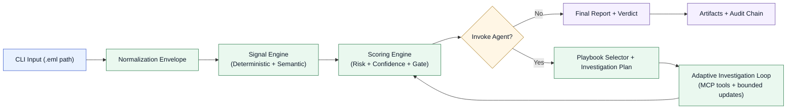

# Phishing Triage Agent (IN DEV)

Evidence-first, deterministic phishing triage from a single `.eml` file, with an agentic investigation loop and outputs that are designed to be reused across CLI, REST API, and MCP adapters.

## Project Status
Early-stage. The engineering plan lives in `Docs/phishing_agent_engineering_report.md`. Current source code is minimal (see `src/Ingestion/intake.py`).

## Goals
- Produce a deterministic verdict (`risk_score`, `verdict`, `reasons[]`) with auditable evidence.
- Provide a strict LLM analyst report constrained to evidence only.
- Start with a CLI UX and share a core that can be wrapped by REST API or MCP with minimal refactor.

## Non-Goals (Initial)
- Full mailbox ingestion (IMAP/Gmail).
- Dynamic detonation of attachments.
- Auto-remediation (quarantine/blocking). We only produce recommendations.

## Architecture Summary
Pipeline stages:
1. Parse & normalize `.eml` into a canonical envelope JSON.
2. Generate bounded signals (`true/false/unknown`) using LLM + deterministic template.
3. Assign playbooks deterministically based on signals.
4. Run an agentic investigation loop with a tool allowlist and evidence logging.
5. Compute a deterministic verdict from evidence and scoring rules.
6. Generate a strict analyst report from evidence only.



Artifacts:
- `envelope.json`, `signals.json`, `evidence_log.jsonl`, `verdict.json`, `analyst_report.json`, and derived IOC bundles.

## Current Components
- Ingestion/Normalization: `/Users/gabe/Documents/Phishing_Triage_Agent/src/Ingestion/intake.py`
- Signal Engine: `/Users/gabe/Documents/Phishing_Triage_Agent/Signal_Engine/signal_engine.py`
- Signal taxonomy/rules: `/Users/gabe/Documents/Phishing_Triage_Agent/Signal_Engine/*.yaml`
- Scoring Engine: `/Users/gabe/Documents/Phishing_Triage_Agent/Scoring_Engine/scoring_engine.py`
- Playbook Selector: `/Users/gabe/Documents/Phishing_Triage_Agent/Playbooks/playbook_selector.py`
- MCP Adapter Stubs + Cache: `/Users/gabe/Documents/Phishing_Triage_Agent/MCP_Adapters/mcp_router.py`
- Investigation Agent (adaptive loop): `/Users/gabe/Documents/Phishing_Triage_Agent/Investigation_Agent/investigation_pipeline.py`
- CLI Runner + service abstraction:
  - `/Users/gabe/Documents/Phishing_Triage_Agent/cli/phishscan.py`
  - `/Users/gabe/Documents/Phishing_Triage_Agent/Investigation_Agent/pipeline_service.py`

## Component Docs
- Normalization pipeline: `/Users/gabe/Documents/Phishing_Triage_Agent/Docs/normalization/normalization_pipeline.md`
- Signal engine pipeline: `/Users/gabe/Documents/Phishing_Triage_Agent/Docs/signals/signal_engine_pipeline.md`
- Semantic signal assessor: `/Users/gabe/Documents/Phishing_Triage_Agent/Docs/signals/semantic_signal_assessor.md`
- Scoring engine pipeline: `/Users/gabe/Documents/Phishing_Triage_Agent/Docs/scoring/scoring_engine_pipeline.md`
- Playbook pipeline: `/Users/gabe/Documents/Phishing_Triage_Agent/Docs/playbooks/playbook_pipeline.md`
- MCP tooling and cache: `/Users/gabe/Documents/Phishing_Triage_Agent/Docs/mcp/mcp_tooling_and_cache.md`
- Investigation pipeline: `/Users/gabe/Documents/Phishing_Triage_Agent/Docs/investigation/investigation_agent_pipeline.md`
- Audit chain: `/Users/gabe/Documents/Phishing_Triage_Agent/Docs/investigation/audit_chain.md`
- Prompt contracts: `/Users/gabe/Documents/Phishing_Triage_Agent/Docs/prompts/prompt_contracts.md`
- Confidence gate and pivot: `/Users/gabe/Documents/Phishing_Triage_Agent/Docs/gating/confidence_gate_and_pivot.md`
- Command-line workflow: `/Users/gabe/Documents/Phishing_Triage_Agent/Docs/cli/command_line_tool.md`

## CLI Usage
Interactive mode (prompts for `.eml` path with extension validation):
```bash
python3 /Users/gabe/Documents/Phishing_Triage_Agent/cli/phishscan.py
```

One-shot mode:
```bash
python3 /Users/gabe/Documents/Phishing_Triage_Agent/cli/phishscan.py \
  --eml /absolute/path/to/email.eml \
  --mode live
```

Optional scrub of run artifacts after each run:
```bash
python3 /Users/gabe/Documents/Phishing_Triage_Agent/cli/phishscan.py --scrub-artifacts
```

## Dynamic Analysis Providers
Current pipeline supports URL dynamic analysis through:
- `urlscan_detonate` (hosted detonation + result polling)
- `cuckoo_url_detonate` (self-hosted CAPE/Cuckoo URL task + report polling)
- `urlhaus_lookup` (malware URL/host reputation enrichment)

Configure API/runtime settings in `/Users/gabe/Documents/Phishing_Triage_Agent/.env` (see `/Users/gabe/Documents/Phishing_Triage_Agent/.env.example`).

## Project Plan
The implementation plan is organized into phases. This README summarizes the plan at a high level; details are in `Docs/phishing_agent_engineering_report.md`.

### Phase 1: CLI MVP
- Parser/Normalizer for `.eml` (MIME, headers, Authentication-Results).
- JSON schema validation for the envelope.
- Bounded signal generation (strict JSON template).
- Deterministic playbook selection.
- Investigation loop with a small tool set (DNS, WHOIS, URL normalization).
- Deterministic verdict core with evidence-backed reasons.
- Strict LLM analyst report.
- CLI command: `phishscan analyze --eml file.eml`.

### Phase 2: Enrichment + Caching
- URL reputation connector.
- Domain intel (age/registrar) with caching.
- Attachment static analyzers (PDF/Office URL extraction, macro indicators).
- IOC bundle export + hunt query generation.

### Phase 3: API + MCP
- REST `POST /analyze` returning `Verdict` + artifacts.
- MCP tool `analyze_email` returning the same schemas.

## Suggested Repo Layout
See Appendix A in `Docs/phishing_agent_engineering_report.md` for a recommended Python package layout.

## How to Contribute (Early)
- Start with `Docs/phishing_agent_engineering_report.md`.
- Implement core primitives in small, testable modules (parser, schema, verdict).
- Add tests for parsing and schema validation from the start.

## License
TBD.
